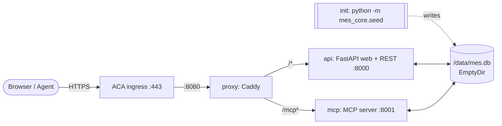

# mock-mes-kr

A **throwaway, on-demand mock MES** (Manufacturing Execution System) for a
**semiconductor fab**, built purely as a **connection point for agent demos**.

One shared SQLite database is exposed through **three surfaces**:

| Surface | Audience | Endpoint | MES functions |
| --- | --- | --- | --- |
| **Web console** | Human | `/` | ALL 7 (view + input) + summary **dashboard** — your control panel |
| **REST API** | Agent | `/api` (docs at `/api/docs`) | 실적입력 · 실적조회 · 재고조회 · 재공조회 |
| **MCP server** | Agent | `/mcp` (streamable HTTP) | 공정입력 · 공정조회 · 로트조회 |

> **MVP / demo only.** A single shared **demo API key** (`changjuahn`) gates the
> agent surfaces (REST + MCP); there is otherwise no real security, no scale/HA.
> The database is
> **ephemeral** and **re-seeded on every cold start**, so every demo run gets a
> fresh, identical fab snapshot. Optimised for simplicity and the cheapest
> possible Azure footprint.

---

## Function → surface map

Each agent channel has at least one register (입력) and one query (조회):

| Function | Web | REST API | MCP |
| --- | :---: | :---: | :---: |
| 실적 입력 — register production result | ✅ | ✅ `POST /api/production-results` | |
| 실적 조회 — production results | ✅ | ✅ `GET /api/production-results` | |
| 재고 조회 — inventory | ✅ | ✅ `GET /api/inventory` | |
| 재공 조회 — WIP | ✅ | ✅ `GET /api/wip` | |
| 공정 입력 — register process move | ✅ | | ✅ `register_process_move` |
| 공정 조회 — route / history | ✅ | | ✅ `get_process_route` / `get_process_history` |
| 로트 조회 — lot | ✅ | | ✅ `get_lot` / `list_lots` |

Because all three surfaces read and write the **same** SQLite file, data entered
on one channel is immediately visible on the others (e.g. a lot moved via the MCP
`register_process_move` tool shows its new step in the web console and in `get_lot`).

---

## Architecture

A **single** Azure Container App (Consumption, one replica, **scale-to-zero**).
All containers in the replica share one **ephemeral `EmptyDir` volume** mounted
at `/data`, holding `mes.db`.



- **init container** — runs `python -m mes_core.seed` to build the schema and
  seed the fab dataset **before** the app containers start (no seeding race).
  Runs on every cold start → fresh, reproducible data each run.
- **api container** — FastAPI/Uvicorn on `:8000`. Serves the web console (`/`)
  and the REST API (`/api/*`, OpenAPI at `/api/docs`).
- **mcp container** — MCP Python SDK (streamable HTTP) on `:8001` at `/mcp`.
- **proxy container** — Caddy. The **single external ingress** (targetPort 8080);
  routes `/mcp*` → `mcp:8001`, everything else → `api:8000`. Gives one clean
  HTTPS FQDN + TLS, with response buffering disabled for SSE/streaming.

Sizing: each container **0.25 vCPU / 0.5 GiB** (ACA minimum), `minReplicas=0`
(~$0 when idle), `maxReplicas=1` (single replica keeps the shared `EmptyDir`
consistent).

Consumer endpoints once deployed:

- Web console — `https://<fqdn>/`
- REST API — `https://<fqdn>/api` (interactive docs `https://<fqdn>/api/docs`)
- MCP server — `https://<fqdn>/mcp`

---

## Tech stack

Python 3.12 · FastAPI + Uvicorn (web + REST) · Jinja2 + a little HTMX/vanilla JS ·
official MCP Python SDK (`mcp`, streamable HTTP) · built-in `sqlite3` (WAL mode +
`busy_timeout` for safe multi-process access). One shared `mes_core` package
(schema, data access, seed) imported by both the API and MCP surfaces. One Docker
image with three entrypoints (`seed` / `api` / `mcp`) plus a tiny Caddy proxy image.

```
mes_core/      db.py (schema + WAL connection + data access), seed.py
api/           main.py (FastAPI), rest.py, web.py, templates/, static/, tests/
mcp_server/    server.py (FastMCP tools), __main__.py, test_server.py
proxy/         Caddyfile, Dockerfile
infra/         main.bicep, deploy.sh
Dockerfile     one app image, three entrypoints
docker-compose.yml   reference topology (Docker is not used for local dev)
.github/workflows/images.yml   build & push the two public GHCR images
```

---

## Data model (semiconductor fab)

| Table | 한글 | Notes |
| --- | --- | --- |
| `lot` | 로트 | lot_id, product, tech_node, **start_qty**, wafer_qty (current), priority, current_step, status, start_date |
| `process_step` | 공정 (route) | seq, step_code, step_name, operation, eqp_type |
| `process_history` | 공정 이력/실적 | lot_id, step_code, eqp_id, **in_qty, out_qty, scrap_qty, defect_code**, in_time, out_time, operator, result — written by 공정 입력 |
| `inventory` | 재고 | item_code, item_name, category, qty, uom, location |
| `production_result` | 실적 | result_date, line, eqp_id, product, good_qty, scrap_qty, yield_pct — written by 실적 입력 |
| `equipment` | 설비 | eqp_id, eqp_name, type, status |

**WIP (재공)** is a **derived** query — running lots grouped by `current_step`.

### Wafer flow, defects & yield

Every process move carries **quantities**: `in_qty` wafers enter the step (defaults
to the lot's current `wafer_qty`), `scrap_qty` are lost to a defect (optional
`defect_code`), and `out_qty = in_qty − scrap_qty` carries forward — so
`lot.wafer_qty` **shrinks** as defects accumulate. Each lot keeps its immutable
`start_qty`, and **cumulative yield** = `wafer_qty / start_qty × 100`. When a lot
**passes the final step (TEST)** it is closed (`status = Done`) and a
`production_result` (실적) is **auto-created** (good = final wafers, scrap =
cumulative lot scrap) — linking 공정 → 실적. The **dashboard** at `/` rolls all of
this up (wafers in/out, cumulative yield, defect rate, top defects, scrap by step).

**Seeded snapshot** (reproducible, RNG-seeded): 4 products (LX9 AP 5nm, DDR5-16G
10nm, V7 NAND 128L, PMIC-33 28nm); an 8-step route
(Diffusion → Photo → Etch → Implant → CVD → CMP → Metrology → Test); 18 lots
(deterministic **4 Done / 2 Hold / 12 Running**) spread across the route with
modelled wafer loss (~88% cumulative yield, ~3% defect rate); 76 process-history
rows; 10 inventory items (wafers, reticles, chemicals, gases, targets, finished
goods, spares); 30 production results (26 daily + 4 auto-실적 from Done lots); 8
pieces of equipment.

---

## Connecting an agent

### Authentication (demo API key)

Both agent surfaces require a header key on **every** call:

```
X-API-Key: changjuahn
```

- Applies to all REST `/api/*` endpoints and the MCP `/mcp` endpoint.
- Missing/wrong key → `401 Unauthorized`.
- The **web console** (`/`) and the **interactive docs** (`/api/docs`,
  `/api/openapi.json`) stay open so humans can browse without a key — in Swagger
  UI click **Authorize** and paste `changjuahn` to try the endpoints.
- The key is configurable via the `MES_API_KEY` env var (defaults to
  `changjuahn`). It's a demo shared secret, not real security.

### REST API (Production & Inventory)

Interactive docs and schema: `https://<fqdn>/api/docs` · `https://<fqdn>/api/openapi.json`

Every list endpoint is **parameterized** (filters, search, sort), plus single-item
lookups and aggregation:

| Endpoint | 기능 | Parameters |
| --- | --- | --- |
| `GET /api/products` | product list | — |
| `GET /api/production-results` | 실적 조회 | `product?`, `line?`, `eqp_id?`, `date_from?`, `date_to?`, `min_yield?`, `sort?` (date/yield/good/scrap), `order?` (asc/desc), `limit?` |
| `POST /api/production-results` | 실적 입력 | body: `product`, `good_qty`, `scrap_qty?`, `line?`, `eqp_id?`, `result_date?`, `yield_pct?` |
| `GET /api/production-results/summary` | 실적 aggregation | `group_by` (product/line) |
| `GET /api/production-results/{id}` | one 실적 | path `id` (404 if missing) |
| `GET /api/inventory` | 재고 조회 | `category?`, `location?`, `q?` (name/code search), `min_qty?`, `max_qty?` |
| `GET /api/inventory/facets` | filter values | — (distinct categories + locations) |
| `GET /api/inventory/{item_code}` | one item | path `item_code` (404 if missing) |
| `GET /api/wip` | 재공 조회 | `step_code?` |

```bash
# 실적 조회 — top-yielding V7 NAND results
curl -H "X-API-Key: changjuahn" \
  "https://<fqdn>/api/production-results?product=V7%20NAND&min_yield=95&sort=yield&order=desc&limit=5"

# 실적 입력 — register a result (yield auto-computed if omitted)
curl -X POST "https://<fqdn>/api/production-results" \
  -H "X-API-Key: changjuahn" \
  -H 'content-type: application/json' \
  -d '{"product":"LX9 AP","good_qty":480,"scrap_qty":12,"line":"FAB1-L1"}'

# 실적 aggregation by product
curl -H "X-API-Key: changjuahn" "https://<fqdn>/api/production-results/summary?group_by=product"

# 재고 조회 — search + qty filter; and facets / single item
curl -H "X-API-Key: changjuahn" "https://<fqdn>/api/inventory?q=wafer&min_qty=1000"
curl -H "X-API-Key: changjuahn" "https://<fqdn>/api/inventory/facets"
curl -H "X-API-Key: changjuahn" "https://<fqdn>/api/inventory/RAW-WAFER-300"

# 재공 조회 — one step
curl -H "X-API-Key: changjuahn" "https://<fqdn>/api/wip?step_code=ETCH"
```

### MCP server (Process & Lot)

Streamable-HTTP endpoint: `https://<fqdn>/mcp`. Tools:

| Tool | 기능 | Parameters |
| --- | --- | --- |
| `register_process_move` | 공정 입력 | `lot_id`, `step_code`, `eqp_id?`, `in_qty?`, `scrap_qty?`, `defect_code?`, `operator?`, `result?` |
| `get_process_route` | 공정 조회 (route) | `step_code?`, `eqp_type?` |
| `get_process_history` | 공정 조회 (history) | `lot_id?`, `step_code?`, `result?`, `operator?`, `defect_code?`, `has_scrap?`, `limit?` |
| `get_lot` | 로트 조회 (one) | `lot_id` (returns wafer qty + `cumulative_yield` + history) |
| `list_lots` | 로트 조회 (list) | `status?`, `product?`, `current_step?`, `priority?`, `tech_node?`, `limit?` |

Example with the MCP Python SDK:

```python
import asyncio
from mcp import ClientSession
from mcp.client.streamable_http import streamablehttp_client

async def main():
    headers = {"X-API-Key": "changjuahn"}
    async with streamablehttp_client("https://<fqdn>/mcp", headers=headers) as (r, w, _):
        async with ClientSession(r, w) as s:
            await s.initialize()
            print([t.name for t in (await s.list_tools()).tools])
            # 공정 입력 with 3 scrapped wafers (out = in - scrap; lot shrinks)
            await s.call_tool("register_process_move",
                              {"lot_id": "LOT0007", "step_code": "ETCH",
                               "eqp_id": "EQP-ETCH01", "scrap_qty": 3,
                               "defect_code": "Etch-Residue", "operator": "agent"})
            # 공정 조회 — only moves that scrapped wafers
            print(await s.call_tool("get_process_history", {"has_scrap": True}))
            print(await s.call_tool("get_lot", {"lot_id": "LOT0007"}))

asyncio.run(main())
```

Popular MCP clients can point straight at `https://<fqdn>/mcp` (transport: HTTP /
streamable HTTP) — configure a header `X-API-Key: changjuahn`.

---

## Local development (no Docker required)

```bash
python3.12 -m venv .venv && . .venv/bin/activate
pip install -r requirements.txt

export MES_DB_PATH="$PWD/data/mes.db"   # default in-container is /data/mes.db
python -m mes_core.seed                 # build + seed the shared DB

# terminal 1 — web console + REST
uvicorn api.main:app --host 0.0.0.0 --port 8000
# terminal 2 — MCP server
python -m mcp_server                    # serves /mcp on :8001
```

Then open <http://localhost:8000/> and <http://localhost:8000/api/docs>, and
point an MCP client at <http://localhost:8001/mcp>.

Run the tests:

```bash
python -m unittest mes_core.test_db api.tests.test_app mcp_server.test_server -v
```

---

## Deploy to Azure (Docker-less, cheapest)

Container images are built **in the cloud** by GitHub Actions and published as
**public** images to GHCR, so Azure Container Apps needs no pull secret.

1. **Push** the branch. `.github/workflows/images.yml` builds and pushes:
   - `ghcr.io/changju-ahn/mock-mes-app` (init + api + mcp share this image)
   - `ghcr.io/changju-ahn/mock-mes-proxy` (Caddy)

   Watch it: `gh run watch`. Ensure both packages are **public**
   (GitHub → Packages → each package → *Package settings* → *Change visibility*
   → Public). This is a one-time setting per package.

2. **Deploy** the infrastructure:

   ```bash
   ./infra/deploy.sh                          # rg-mock-mes-kr / koreacentral
   # or override:
   RG=rg-mock-mes-kr LOCATION=eastus ./infra/deploy.sh
   ```

   The script registers the `Microsoft.App` / `Microsoft.OperationalInsights`
   providers and the `containerapp` CLI extension, creates the resource group,
   and deploys `infra/main.bicep`. It prints the live FQDN and the three endpoints.

### Redeploy

Push again (CI rebuilds `:latest`), then re-run `./infra/deploy.sh` (idempotent),
or force the app to pick up a fresh image:

```bash
az containerapp update -g rg-mock-mes-kr -n mock-mes \
  --revision-suffix "r$(date +%s)"
```

Because the DB is an `EmptyDir`, any new replica re-runs the seed init container
→ a fresh dataset.

### Teardown

```bash
az group delete -n rg-mock-mes-kr --yes --no-wait
```

---

## Cost notes

- **Scale-to-zero** (`minReplicas=0`): with no traffic the app runs **zero
  replicas** and Container Apps bills ~**$0** for compute (you pay only when a
  request wakes it, plus a tiny cost for the Log Analytics workspace / storage).
- Single replica at **0.75 vCPU / 1.5 GiB** total (3 × 0.25 vCPU / 0.5 GiB) only
  while serving requests. First request after idle incurs a **cold start**
  (containers pull + the seed init container runs).
- Public GHCR images → **no** Azure Container Registry needed.
- Delete the resource group to drop cost to zero.

---

## Assumptions

- Single-replica by design: the shared SQLite lives on a per-replica `EmptyDir`,
  so horizontal scale is intentionally capped at 1 (`maxReplicas=1`).
- Ephemeral data is a feature, not a bug — every cold start re-seeds, which keeps
  demos reproducible. Nothing is persisted between replica lifetimes.
- A single shared demo key (`X-API-Key: changjuahn`) gates the REST + MCP agent
  surfaces so calls look like any other keyed API/MCP; it is **not** real security.
  The human web console and `/api/docs` stay open. Do not put real or sensitive
  data in it.
