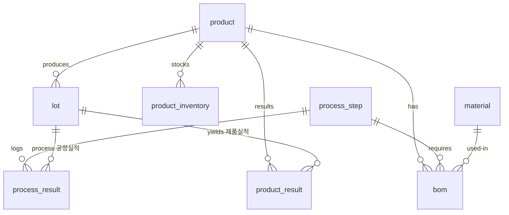
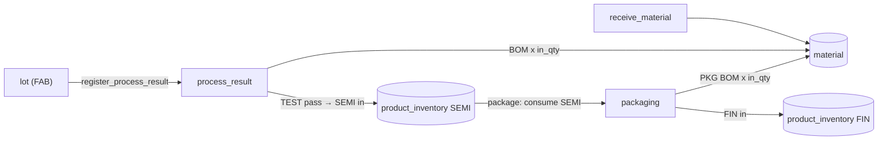

# mock-mes-kr

A **throwaway, on-demand mock MES** (Manufacturing Execution System) for a
**semiconductor fab**, built purely as a **connection point for agent demos**.
One shared SQLite database — modelling a **two-stage fab** (FAB → Packaging),
BOM-driven material consumption, and two product inventories (SEMI + FIN) — is
exposed through **three surfaces**:

| Surface | Audience | Endpoint | Scope |
| --- | --- | --- | --- |
| **Web console** | Human | `/` | All MES functions (view + input) + dashboard |
| **REST API** | Agent / key | `/api` (docs: `/api/docs`) | Product · Material · BOM |
| **MCP server** | Agent / key | `/mcp` (docs: `/mcp-docs`) | Process · Lot |

> **MVP / demo only.** The database is **ephemeral** and **re-seeded on every
> cold start**, so every demo run gets a fresh, identical fab snapshot. A single
> shared demo key (`changjuahn`) gates the agent surfaces; there is no real
> security.

---

## Architecture

A **single** Azure Container App (Consumption, one replica, **scale-to-zero**).
All containers in the replica share one **ephemeral `EmptyDir` volume** mounted
at `/data`, holding `mes.db`.


| Container | Image | Role |
| --- | --- | --- |
| **seed** (init) | `mock-mes-app` | Runs `python -m mes_core.seed` once before app containers start; exits |
| **api** | `mock-mes-app` | FastAPI/Uvicorn on `:8000` — web console (`/`) + REST (`/api`) |
| **mcp** | `mock-mes-app` | MCP streamable HTTP on `:8001` at `/mcp` |
| **proxy** | `mock-mes-proxy` | Caddy on `:8080` — single external ingress, routes `/mcp*` → mcp, `/*` → api |

Two public GHCR images are built by `.github/workflows/images.yml`:
`ghcr.io/changju-ahn/mock-mes-app` and `ghcr.io/changju-ahn/mock-mes-proxy`.

Sizing: each container **0.25 vCPU / 0.5 GiB** (ACA minimum), `minReplicas=0`
(~$0 when idle), `maxReplicas=1` (single replica; shared `EmptyDir` is per-replica).

---

## Data model

Nine tables across two stages (**FAB** and **Packaging**), one BOM, and two
inventories.

| Table | 한글 | Key columns |
| --- | --- | --- |
| `product` | 제품 | product_code, product_name, tech_node |
| `process_step` | 공정 | seq, step_code, step_name, eqp_type, stage (`FAB`/`PACK`) |
| `lot` | 로트 | lot_id, product_code, wafer_qty, current_step, status (`Running`/`Hold`/`Done`) |
| `process_result` | 공정실적 | lot_id, step_code, eqp_id, in_qty, out_qty, scrap_qty, defect_code, result |
| `material` | 자재 | material_code, material_name, category, qty, uom, location |
| `bom` | BOM | product_code, step_code, material_code, qty_per_wafer, uom |
| `product_inventory` | 제품재고 | product_code, item_type (`SEMI`/`FIN`), qty |
| `product_result` | 제품실적 | lot_id, product_code, item_type, good_qty, scrap_qty, source (`AUTO_FAB`/`AUTO_PACK`/`MANUAL`) |
| `equipment` | 설비 | eqp_id, eqp_name, eqp_type, status |

### Entity-relationship diagram



---

## Process flow

```
Materials ──(BOM × wafers)──▶ Process results ──(TEST pass)──▶ SEMI ──(Packaging)──▶ FIN
```

1. **`start_lot`** — create a FAB lot (`status=Running`, `current_step=DIFF`).
2. **`register_process_result` × 8** — move the lot through DIFF → PHOTO → ETCH →
   IMPL → CVD → CMP → METRO → TEST. Each move:
   - consumes BOM materials: `need = qty_per_wafer × in_qty` per (product, step) BOM row;
     material qty floored at 0; **shortages are recorded but non-blocking**.
   - `out_qty = in_qty − scrap_qty`; the lot's `wafer_qty` shrinks with each scrap.
3. **TEST pass → SEMI auto-receipt** — passing the final FAB step (TEST) sets
   `lot.status=Done` and automatically adds good wafers to `product_inventory` as
   `SEMI` (also writes a `product_result` with `source=AUTO_FAB`).
4. **`POST /api/packaging`** (or web `/product-inventory`) — consume SEMI stock
   (this **blocks** if insufficient SEMI) and PKG-step BOM materials (non-blocking
   shortages); produce FIN inventory and a `product_result` with `source=AUTO_PACK`.
5. Manual entry at `/product-results` or `POST /api/product-results` writes a
   `product_result` with `source=MANUAL`.

### Transaction flow



---

## Surfaces & endpoints

### Web console — `/` (all open, no key)

| Page | URL | Actions |
| --- | --- | --- |
| Dashboard | `/` | Summary: lots, WIP, inventory, results |
| Lots | `/lots` | List + filter; start a lot |
| Lot detail | `/lots/{lot_id}` | Step history, wafer qty, yield |
| Process results | `/process` | List + register a process move |
| Product inventory | `/product-inventory` | SEMI + FIN stock; trigger packaging |
| Product results | `/product-results` | List; manual entry |
| Materials | `/materials` | Inventory + by-step BOM view; receive material |
| BOM | `/bom` | List; upsert / delete rows |
| WIP | `/wip` | Non-Done lots grouped by step |
| Equipment | `/equipment` | Equipment list |
| Guide | `/guide` | Step-by-step usage walkthrough |
| MCP docs | `/mcp-docs` | MCP tool reference + client config (see below) |

### REST API — `/api` (requires `X-API-Key: changjuahn`)

Interactive docs at **`/api/docs`** (open — no key needed to browse).

| Method | Endpoint | 기능 |
| --- | --- | --- |
| `GET` | `/api` | Index + endpoint list + pointer to the MCP surface |
| `GET` | `/api/health` | DB status + row counts |
| `GET` | `/api/products` | Product list |
| `GET` | `/api/product-inventory` | SEMI / FIN stock (`?product_code`, `?item_type`) |
| `GET` | `/api/product-results` | Product results (`?product_code`, `?item_type`, `?source`, `?lot_id`, `?date_from`, `?date_to`, `?limit`) |
| `POST` | `/api/product-results` | Manual product result entry |
| `POST` | `/api/packaging` | Run packaging (SEMI → FIN) |
| `GET` | `/api/materials` | Material inventory (`?category`, `?location`, `?q`, `?min_qty`, `?max_qty`) |
| `GET` | `/api/materials/by-step` | BOM × material on-hand per step (`?step_code`) |
| `POST` | `/api/materials/receipt` | Receive material (upsert qty) |
| `GET` | `/api/bom` | BOM rows (`?product_code`, `?step_code`) |
| `PUT` | `/api/bom` | Upsert a BOM row |
| `DELETE` | `/api/bom/{bom_id}` | Delete a BOM row |

### MCP server — `/mcp` (requires `X-API-Key: changjuahn`)

Streamable HTTP (`stateless_http=True`). Seven tools:

| Tool | 기능 |
| --- | --- |
| `start_lot` | Create a FAB lot (product_code, start_qty, priority?) |
| `register_process_result` | Record a process move; returns shortages + semi_receipt |
| `get_lot` | One lot with history, cumulative yield |
| `list_lots` | Filter by status, product_code, current_step, priority, tech_node |
| `get_process_route` | Route steps (step_code?, eqp_type?, stage?) |
| `list_process_results` | Process results (lot_id?, step_code?, result?, has_scrap?, ...) |
| `get_wip` | Non-Done lots grouped by current step (step_code?) |

> **Lot history is MCP-only.** There is deliberately no `GET /api/lots`; a human
> reads a lot's step history at `/lots/{lot_id}` in the web console, and an agent
> reads it with the `get_lot` tool.

#### MCP docs — `/mcp-docs` + `/mcp-docs.json` (open, no key)

Swagger can only describe the REST half, which made the MCP surface invisible to
anyone browsing the site. The console therefore ships its own MCP reference,
mirroring the REST pair:

| | REST | MCP |
| --- | --- | --- |
| Human docs | `/api/docs` | **`/mcp-docs`** |
| Machine spec | `/api/openapi.json` | **`/mcp-docs.json`** |

`api/mcp_spec.py` builds both by calling `FastMCP.list_tools()` on the very same
`mcp_server.server.mcp` object the MCP container serves — a local registry
lookup, no network hop — so the page cannot drift from the running server. The
page renders, per tool: signature, Korean/English description, a parameter table
(type · required · default) derived from the live JSON Schema, the return shape,
behavioural rules, a ready-to-paste `tools/call` envelope, and the raw
`inputSchema`. It also carries copy-paste client configs for VS Code, Claude
Desktop (via `mcp-remote`), the Python SDK, and `curl`.

A test asserts that every tool the server exposes is documented, so adding a
tool without documenting it fails CI.

---

## Agent connection examples

### curl — REST

```bash
# SEMI + FIN inventory
curl -H "X-API-Key: changjuahn" "https://<fqdn>/api/product-inventory"

# Run packaging: consume 10 SEMI wafers → FIN
curl -X POST "https://<fqdn>/api/packaging" \
  -H "X-API-Key: changjuahn" \
  -H "Content-Type: application/json" \
  -d '{"product_code": "LX9", "in_qty": 10}'
```

### Python — MCP

```python
import asyncio
from mcp import ClientSession
from mcp.client.streamable_http import streamablehttp_client

async def main():
    url = "https://<fqdn>/mcp"
    headers = {"X-API-Key": "changjuahn"}
    async with streamablehttp_client(url, headers=headers) as (r, w, _):
        async with ClientSession(r, w) as s:
            await s.initialize()
            # Start a new FAB lot
            lot = await s.call_tool("start_lot",
                                    {"product_code": "LX9", "start_qty": 25})
            print(lot)
            # Check WIP grouped by step
            wip = await s.call_tool("get_wip", {})
            print(wip)

asyncio.run(main())
```

Popular MCP clients (e.g. Claude Desktop, VS Code) can point directly at
`https://<fqdn>/mcp` (transport: streamable HTTP) with header `X-API-Key: changjuahn`.
Ready-to-paste config for each client is on **`https://<fqdn>/mcp-docs`**.

---

## Local development

```bash
python3.12 -m venv .venv && . .venv/bin/activate
pip install -r requirements.txt

# Seed the DB (creates data/mes.db)
MES_DB_PATH=$(pwd)/data/mes.db python -m mes_core.seed

# Terminal 1 — web console + REST API
uvicorn api.main:app --port 8000

# Terminal 2 — MCP server (serves /mcp on :8001)
python -m mcp_server
```

Browse: <http://localhost:8000/> · <http://localhost:8000/api/docs>  
MCP endpoint: `http://localhost:8001/mcp`

Run tests:

```bash
python -m unittest mes_core.test_db api.tests.test_app mcp_server.test_server
```

---

## Deploy / redeploy / teardown

Images are built and pushed to public GHCR by CI — Azure needs no registry credentials.

**1 · Push branch** → `.github/workflows/images.yml` builds and pushes:
- `ghcr.io/changju-ahn/mock-mes-app:latest`
- `ghcr.io/changju-ahn/mock-mes-proxy:latest`

Ensure both packages are set to **Public** in GitHub (Packages → *Package settings* → *Change visibility*). One-time step per package.

**2 · Deploy**

```bash
./infra/deploy.sh          # defaults: rg=rg-mock-mes-kr, region=koreacentral
# Override:
RG=rg-mock-mes-kr LOCATION=koreacentral ./infra/deploy.sh
```

The script creates the resource group and deploys `infra/main.bicep` (ACA
environment + Container App). It prints the three live endpoints on completion.

**3 · Redeploy** (pick up a new `:latest` or force a cold-start reseed):

```bash
az containerapp update -g rg-mock-mes-kr -n mock-mes \
  --revision-suffix "r$(date +%s)"
```

Each new revision re-runs the seed init container → fresh, reproducible dataset.

**4 · Teardown**

```bash
az group delete -n rg-mock-mes-kr --yes --no-wait
```

---

## Cost notes

- **Scale-to-zero** (`minReplicas=0`): ~**$0** compute when idle (billed only
  during active request handling, plus a small Log Analytics cost).
- Each container: **0.25 vCPU / 0.5 GiB** (ACA minimum); three app containers
  total **0.75 vCPU / 1.5 GiB** per replica.
- Single replica (`maxReplicas=1`): the shared `EmptyDir` SQLite is per-replica.
- SQLite is **ephemeral** — data is lost on every cold start; the seed init
  container restores the deterministic snapshot automatically.
- Public GHCR images → **no** Azure Container Registry needed.

---

## Seeded data snapshot

Re-seeded on every cold start (deterministic):

| Entity | Count |
| --- | --- |
| Products | 4 |
| Process steps | 9 (8 FAB: DIFF · PHOTO · ETCH · IMPL · CVD · CMP · METRO · TEST; + 1 PACK: PKG) |
| Equipment | 9 |
| Materials | 12 |
| BOM rows | **48** |
| Lots | 16 (6 Done / 2 Hold / 8 Running) |
| Process results | **91** |
| Product inventory rows | 7 (SEMI + FIN across products) |
| Product results | 10 (6 AUTO_FAB + 3 AUTO_PACK + 1 MANUAL) |

> **Note:** the database is ephemeral. All data above is re-created identically
> on every cold start. Do not store anything you need to keep.
