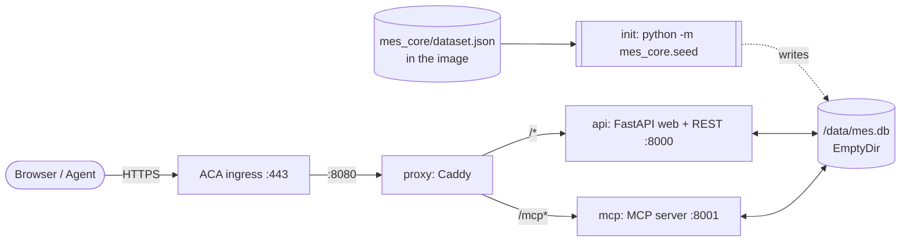
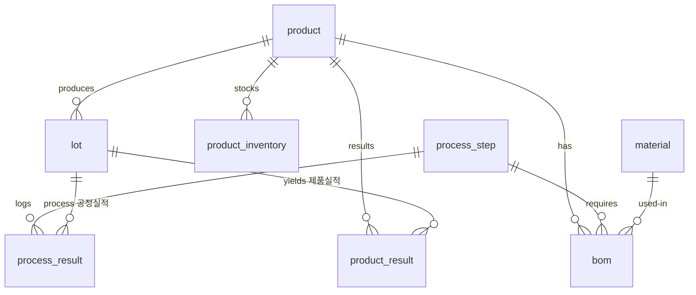
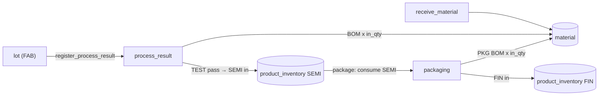

# mock-mes-kr

A **throwaway, on-demand mock MES** (Manufacturing Execution System) for a
**semiconductor fab**, built purely as a **connection point for agent demos**.
One shared SQLite database — modelling a **two-stage fab** (FAB → Packaging),
BOM-driven material consumption, and two product inventories (SEMI + FIN) — is
exposed through **three surfaces**:

| Surface | Audience | Endpoint | Scope |
| --- | --- | --- | --- |
| **Web console** | Human | `/` | All MES functions (view + input) + dashboard |
| **REST API** | Agent / key | `/api` (docs: `/api/docs`) | Master · Product · Material · BOM |
| **MCP server** | Agent / key | `/mcp` (docs: `/mcp-docs`) | Process · Lot · Master |

> **MVP / demo only.** The dataset is a **fixture checked into source**
> (`mes_core/dataset.json`), reloaded on every boot. Every identifier, quantity
> and yield is a literal, so it cannot drift; only the calendar moves, and it
> moves rigidly (see [Data durability](#data-durability-and-what-can-delete-it)).
> Runtime writes survive as long as the app is up. A single shared demo key
> (`changjuahn`) gates the agent surfaces; there is no real security.

---

## Architecture

A **single** Azure Container App (Consumption, **always one replica**). All
containers in the replica share one **ephemeral `EmptyDir` volume** mounted at
`/data`, holding `mes.db`.



| Container | Image | Role |
| --- | --- | --- |
| **seed** (init) | `mock-mes-app` | Runs `python -m mes_core.seed` once before app containers start; exits |
| **api** | `mock-mes-app` | FastAPI/Uvicorn on `:8000` — web console (`/`) + REST (`/api`) |
| **mcp** | `mock-mes-app` | MCP streamable HTTP on `:8001` at `/mcp` |
| **proxy** | `mock-mes-proxy` | Caddy on `:8080` — single external ingress, routes `/mcp*` → mcp, `/*` → api |

Two public GHCR images are built by `.github/workflows/images.yml`:
`ghcr.io/changju-ahn/mock-mes-app` and `ghcr.io/changju-ahn/mock-mes-proxy`.

Sizing: each container **0.25 vCPU / 0.5 GiB** (ACA minimum), `maxReplicas=1`
(single replica; the shared `EmptyDir` is per-replica).

`minReplicas=1` is deliberate and costs money. `/data` dies with the replica,
so under scale-to-zero an external client's writes would vanish a few minutes
after it stopped calling — making a create/update/delete test unverifiable.
Keeping one replica warm is what makes runtime writes observable. Stop the app
to reset the data; stop it to stop paying.

---

## Data model

Nine tables across two stages (**FAB** and **Packaging**), one BOM, and two
inventories.

| Table | 한글 | Key columns |
| --- | --- | --- |
| `product` | 제품 | product_code, product_name, tech_node |
| `process_step` | 공정 | seq, step_code, step_name, eqp_type, stage (`FAB`/`PACK`) |
| `lot` | 로트 | lot_id, product_code, wafer_qty, current_step, status (`Running`/`Hold`/`Done`) |
| `process_result` | 공정실적 | lot_id, step_code, eqp_id, in_qty, out_qty, scrap_qty, defect_code, result |
| `material` | 자재 | material_code, material_name, category, qty, uom, location |
| `bom` | BOM | product_code, step_code, material_code, qty_per_wafer, uom |
| `product_inventory` | 제품재고 | product_code, item_type (`SEMI`/`FIN`), qty |
| `product_result` | 제품실적 | lot_id, product_code, item_type, good_qty, scrap_qty, source (`AUTO_FAB`/`AUTO_PACK`/`MANUAL`) |
| `equipment` | 설비 | eqp_id, eqp_name, eqp_type, status |

### Entity-relationship diagram



---

## Process flow

```
Materials ──(BOM × wafers)──▶ Process results ──(TEST pass)──▶ SEMI ──(Packaging)──▶ FIN
```

1. **`start_lot`** — create a FAB lot (`status=Running`, `current_step=DIFF`).
2. **`register_process_result` × 8** — move the lot through DIFF → PHOTO → ETCH →
   IMPL → CVD → CMP → METRO → TEST. Each move:
   - consumes BOM materials: `need = qty_per_wafer × in_qty` per (product, step) BOM row;
     material qty floored at 0; **shortages are recorded but non-blocking**.
   - `out_qty = in_qty − scrap_qty`; the lot's `wafer_qty` shrinks with each scrap.
3. **TEST pass → SEMI auto-receipt** — passing the final FAB step (TEST) sets
   `lot.status=Done` and automatically adds good wafers to `product_inventory` as
   `SEMI` (also writes a `product_result` with `source=AUTO_FAB`).
4. **`POST /api/packaging`** (or web `/product-inventory`) — consume SEMI stock
   (this **blocks** if insufficient SEMI) and PKG-step BOM materials (non-blocking
   shortages); produce FIN inventory and a `product_result` with `source=AUTO_PACK`.
5. Manual entry at `/product-results` or `POST /api/product-results` writes a
   `product_result` with `source=MANUAL`.

### Transaction flow



---

## Surfaces & endpoints

### Web console — `/` (all open, no key)

| Page | URL | Actions |
| --- | --- | --- |
| Dashboard | `/` | Summary: lots, WIP, inventory, results |
| Lots | `/lots` | List + filter; start a lot |
| Lot detail | `/lots/{lot_id}` | Step history, wafer qty, yield |
| Process results | `/process` | List + register a process move |
| Product inventory | `/product-inventory` | SEMI + FIN stock; trigger packaging |
| Product results | `/product-results` | List; manual entry |
| Materials | `/materials` | Inventory + by-step BOM view; receive material |
| BOM | `/bom` | List; upsert / delete rows |
| WIP | `/wip` | Non-Done lots grouped by step |
| Products | `/products` | Product master: list, register, rename, delete |
| Equipment | `/equipment` | Equipment master: list, register, edit, delete |
| Guide | `/guide` | Step-by-step usage walkthrough |
| MCP docs | `/mcp-docs` | MCP tool reference + client config (see below) |

### REST API — `/api` (requires `X-API-Key: changjuahn`)

Interactive docs at **`/api/docs`** (open — no key needed to browse).

| Method | Endpoint | 기능 |
| --- | --- | --- |
| `GET` | `/api` | Index + endpoint list + pointer to the MCP surface |
| `GET` | `/api/health` | DB status + row counts |
| `GET` | `/api/products` | Product list |
| `POST` | `/api/products` | Register a product (409 if the code is taken) |
| `GET` | `/api/products/{product_code}` | One product |
| `PATCH` | `/api/products/{product_code}` | Rename / restate node (the code itself is immutable) |
| `DELETE` | `/api/products/{product_code}` | Delete a product (409 while anything references it) |
| `GET` | `/api/equipments` | Equipment list |
| `POST` | `/api/equipments` | Register a tool (409 if the id is taken) |
| `GET` | `/api/equipments/{eqp_id}` | One tool |
| `PATCH` | `/api/equipments/{eqp_id}` | Rename / retype / set status (Run · Idle · Down) |
| `DELETE` | `/api/equipments/{eqp_id}` | Delete a tool (409 while process results reference it) |
| `GET` | `/api/product-inventory` | SEMI / FIN stock (`?product_code`, `?item_type`) |
| `GET` | `/api/product-results` | Product results (`?product_code`, `?item_type`, `?source`, `?lot_id`, `?date_from`, `?date_to`, `?limit`) |
| `POST` | `/api/product-results` | Manual product result entry |
| `POST` | `/api/packaging` | Run packaging (SEMI → FIN) |
| `GET` | `/api/materials` | Material inventory (`?category`, `?location`, `?q`, `?min_qty`, `?max_qty`) |
| `GET` | `/api/materials/by-step` | BOM × material on-hand per step (`?step_code`) |
| `POST` | `/api/materials/receipt` | Receive material (upsert qty) |
| `GET` | `/api/bom` | BOM rows (`?product_code`, `?step_code`) |
| `PUT` | `/api/bom` | Upsert a BOM row |
| `DELETE` | `/api/bom/{bom_id}` | Delete a BOM row |

### MCP server — `/mcp` (requires `X-API-Key: changjuahn`)

Streamable HTTP (`stateless_http=True`). Fifteen tools:

| Tool | 기능 |
| --- | --- |
| `start_lot` | Create a FAB lot (product_code, start_qty, priority?) |
| `register_process_result` | Record a process move; returns shortages + semi_receipt |
| `get_lot` | One lot with history, cumulative yield |
| `list_lots` | Filter by status, product_code, current_step, priority, tech_node |
| `get_process_route` | Route steps (step_code?, eqp_type?, stage?) |
| `list_process_results` | Process results (lot_id?, step_code?, result?, has_scrap?, ...) |
| `get_wip` | Non-Done lots grouped by current step (step_code?) |
| `list_products` · `create_product` · `update_product` · `delete_product` | Product master CRUD |
| `list_equipments` · `create_equipment` · `update_equipment` · `delete_equipment` | Equipment master CRUD |

The eight master-data tools exist so an agent can run a real mutation test
against a live MES. They fail politely — a refused delete or a duplicate key
comes back as `{"error": ...}`, never as a raised exception, because a raised
exception inside a tool call reads as a broken server to the client.

> **Lot history is MCP-only.** There is deliberately no `GET /api/lots`; a human
> reads a lot's step history at `/lots/{lot_id}` in the web console, and an agent
> reads it with the `get_lot` tool.

#### MCP docs — `/mcp-docs` + `/mcp-docs.json` (open, no key)

Swagger can only describe the REST half, which made the MCP surface invisible to
anyone browsing the site. The console therefore ships its own MCP reference,
mirroring the REST pair:

| | REST | MCP |
| --- | --- | --- |
| Human docs | `/api/docs` | **`/mcp-docs`** |
| Machine spec | `/api/openapi.json` | **`/mcp-docs.json`** |

`api/mcp_spec.py` builds both by calling `FastMCP.list_tools()` on the very same
`mcp_server.server.mcp` object the MCP container serves — a local registry
lookup, no network hop — so the page cannot drift from the running server. The
page renders, per tool: signature, Korean/English description, a parameter table
(type · required · default) derived from the live JSON Schema, the return shape,
behavioural rules, a ready-to-paste `tools/call` envelope, and the raw
`inputSchema`. It also carries copy-paste client configs for VS Code, Claude
Desktop (via `mcp-remote`), the Python SDK, and `curl`.

A test asserts that every tool the server exposes is documented, so adding a
tool without documenting it fails CI.

The connection URLs on the page are published as `https://` for any non-local
host. Caddy listens on plaintext `:8080` and rewrites `X-Forwarded-Proto` to its
own listener's scheme, so the request scheme reaching uvicorn is always `http`;
echoing it back would hand out URLs that ACA (`allowInsecure: false`) redirects,
and a redirected JSON-RPC `POST` breaks MCP clients and `curl -sN`. Set
`MES_PUBLIC_BASE_URL` (e.g. `https://mes.example.com`) to override the origin
outright when running behind a different proxy or on a sub-path.

---

## Agent connection examples

### curl — REST

```bash
# SEMI + FIN inventory
curl -H "X-API-Key: changjuahn" "https://<fqdn>/api/product-inventory"

# Run packaging: consume 10 SEMI wafers → FIN
curl -X POST "https://<fqdn>/api/packaging" \
  -H "X-API-Key: changjuahn" \
  -H "Content-Type: application/json" \
  -d '{"product_code": "LX9", "in_qty": 10}'
```

### Python — MCP

```python
import asyncio
from mcp import ClientSession
from mcp.client.streamable_http import streamablehttp_client

async def main():
    url = "https://<fqdn>/mcp"
    headers = {"X-API-Key": "changjuahn"}
    async with streamablehttp_client(url, headers=headers) as (r, w, _):
        async with ClientSession(r, w) as s:
            await s.initialize()
            # Start a new FAB lot
            lot = await s.call_tool("start_lot",
                                    {"product_code": "LX9", "start_qty": 25})
            print(lot)
            # Check WIP grouped by step
            wip = await s.call_tool("get_wip", {})
            print(wip)

asyncio.run(main())
```

Popular MCP clients (e.g. Claude Desktop, VS Code) can point directly at
`https://<fqdn>/mcp` (transport: streamable HTTP) with header `X-API-Key: changjuahn`.
Ready-to-paste config for each client is on **`https://<fqdn>/mcp-docs`**.

---

## Local development

```bash
python3.12 -m venv .venv && . .venv/bin/activate
pip install -r requirements.txt

# Seed the DB (creates data/mes.db)
MES_DB_PATH=$(pwd)/data/mes.db python -m mes_core.seed

# Terminal 1 — web console + REST API
uvicorn api.main:app --port 8000

# Terminal 2 — MCP server (serves /mcp on :8001)
python -m mcp_server
```

Browse: <http://localhost:8000/> · <http://localhost:8000/api/docs>  
MCP endpoint: `http://localhost:8001/mcp`

Run tests:

```bash
python -m unittest mes_core.test_db mes_core.test_schedule api.tests.test_app mcp_server.test_server
```

### Changing the mock data

The dataset is a fixture, not a generator, so edits are deliberate and show up
in a diff:

```bash
# hand-edit a row
$EDITOR mes_core/dataset.json

# or re-cut the whole thing from the generator (destructive: every
# in/out window is redrawn, so downstream sensor archives will not line up)
python -m mes_core.generate --force
```

---

## Deploy / redeploy / teardown

Images are built and pushed to public GHCR by CI — Azure needs no registry credentials.

**1 · Push branch** → `.github/workflows/images.yml` builds and pushes:
- `ghcr.io/changju-ahn/mock-mes-app:latest`
- `ghcr.io/changju-ahn/mock-mes-proxy:latest`

Ensure both packages are set to **Public** in GitHub (Packages → *Package settings* → *Change visibility*). One-time step per package.

**2 · Deploy**

```bash
./infra/deploy.sh          # defaults: rg=rg-mock-mes-kr, region=koreacentral
# Override:
RG=rg-mock-mes-kr LOCATION=koreacentral ./infra/deploy.sh
```

The script creates the resource group and deploys `infra/main.bicep` (ACA
environment + Container App). It prints the three live endpoints on completion.

**3 · Redeploy** (pick up a new `:latest`, or force a reset):

```bash
az containerapp update -g rg-mock-mes-kr -n mock-mes \
  --revision-suffix "r$(date +%s)"
```

Each new revision re-runs the seed init container, which reloads
`dataset.json` — so any runtime writes are discarded and the shipped dataset
comes back. To reset without deploying:

```bash
az containerapp revision restart -g rg-mock-mes-kr -n mock-mes \
  --revision $(az containerapp show -g rg-mock-mes-kr -n mock-mes \
                 --query properties.latestReadyRevisionName -o tsv)
```

**4 · Teardown**

```bash
az group delete -n rg-mock-mes-kr --yes --no-wait
```

---

## Cost notes

- **One replica is always warm** (`minReplicas=1`), so this does **not** idle at
  $0. That is the price of letting an external client write and read its writes
  back; `az containerapp update --min-replicas 0` trades it away.
- Each container: **0.25 vCPU / 0.5 GiB** (ACA minimum); three app containers
  total **0.75 vCPU / 1.5 GiB** per replica.
- Single replica (`maxReplicas=1`): the shared `EmptyDir` SQLite is per-replica.
- SQLite is **ephemeral** — data is lost on every cold start; the seed init
  container restores the deterministic snapshot automatically.
- Public GHCR images → **no** Azure Container Registry needed.

---

## Seeded data snapshot

Loaded from `mes_core/dataset.json` on every boot:

| Entity | Count |
| --- | --- |
| Products | 4 |
| Process steps | 9 (8 FAB: DIFF · PHOTO · ETCH · IMPL · CVD · CMP · METRO · TEST; + 1 PACK: PKG) |
| Equipment | 9 |
| Materials | 12 |
| BOM rows | **48** |
| Lots | 16 (6 Done / 2 Hold / 8 Running) |
| Process results | **91** |
| Product inventory rows | 7 (SEMI + FIN across products) |
| Product results | 10 (6 AUTO_FAB + 3 AUTO_PACK + 1 MANUAL) |

> The dataset is a **fixture checked into the repo**, not something computed at
> boot. There is no RNG on the boot path, so editing the code that originally
> produced these rows cannot change them — only editing `dataset.json` can.

### Time axis

The one thing that is *not* frozen is the calendar. On each boot the entire
history is translated so its first process step lands **three months before the
boot date**, which keeps a long-running demo from looking abandoned.

It is a pure translation by **whole days**, and that is the important part:

| Preserved exactly | Moves |
| --- | --- |
| Every step's duration | The calendar date of every row |
| Every gap between steps | |
| Every time of day (a `07:13` start stays `07:13`) | |
| Tool assignment and step order | |

So if `LOT0001`'s PHOTO step occupied a 55-minute window on `EQP-PHOT01`, it
still occupies exactly 55 minutes on `EQP-PHOT01` after any restart — only the
date it sits on changes.

| | |
|---|---|
| History starts | `today (UTC) − 90 days` |
| Pin it | `MES_HISTORY_START` env var (UTC ISO date, e.g. `2026-06-10`) |
| Span | ~65 h of activity from that start |
| Release interval | 240 min between lots |
| Ordering | rows are inserted oldest-first, so `id` tracks time |

**Consequence for downstream systems:** because the shift is by whole days, two
boots on the same UTC date produce a byte-identical database — but a boot
tomorrow moves every window forward one day. A sensor archive that brackets its
readings by a lot's `in_time`/`out_time` must therefore **read the windows from
this MES** rather than cache them once.

To freeze the dates outright — the right choice if something external has
already recorded data against a specific window — pin the start:

```bash
az deployment group create -g <rg> -f infra/main.bicep -p historyStart=2026-06-10
```

### Data durability and what can delete it

External systems connect to this MES **by identifier** (`LOT0001`, `LX9`,
`RAW-WAFER-300`, …) and **by time window**, so it matters exactly what can make
either disappear.

**Boot is the only thing that resets the database.** The seed init container
runs `reset_db()` then reloads the fixture, and a redeploy is just another
boot. There is no scheduler, TTL or background cleanup.

| | What it removes | Trigger | Auth |
| --- | --- | --- | --- |
| `db.reset_db()` | **every row in all 9 tables** | seed init container, **every boot** | n/a |
| `db.delete_bom()` | one BOM row | `DELETE /api/bom/{id}` · `POST /bom/{id}/delete` | key · none |
| `db.delete_product()` | one product | `DELETE /api/products/{code}` · console · MCP | key · none · key |
| `db.delete_equipment()` | one tool | `DELETE /api/equipments/{id}` · console · MCP | key · none · key |

Row deletes exist so that an outside client can run a real
create/update/delete test. They are **fenced**: this schema declares no foreign
keys, so `delete_product()` and `delete_equipment()` check for referencing rows
in Python and refuse while any exist, naming what is in the way
(`still referenced by 4 lots, 12 BOM rows`). REST answers **409**, MCP returns
an `{"error": ...}` payload rather than raising. Master-data **keys are
immutable** — you can rename `LX9`, you cannot renumber it — because lots, BOM
rows and process results all carry the code with nothing to keep them honest.

Nothing can wipe the database wholesale from outside: there is no
reset/purge/drop tool on any surface.

What this means in practice:

- **Seeded rows always come back.** Identifiers are safe to hard-code
  externally; time windows are safe to hard-code only if you pin
  `MES_HISTORY_START`.
- **Runtime writes survive while the app is up, and only while it is up.** That
  is what `minReplicas=1` buys. Restart the revision to get the shipped dataset
  back — that *is* the undo button, including for a delete made through the
  unauthenticated console.

`SeedImmutabilityTests`, `HistoryWindowTests`, `KeyStabilityTests`,
`MasterDataWriteSurfaceTests` and `DeletionSurfaceTests` pin all of this: that
the fixture round-trips every table, that re-timing is a single rigid shift
that preserves every duration and gap, the exact key baseline, that every
delete path is fenced, and that no tool can drop the database. Adding an
unfenced delete path or letting the seed become non-reproducible fails the
suite.
