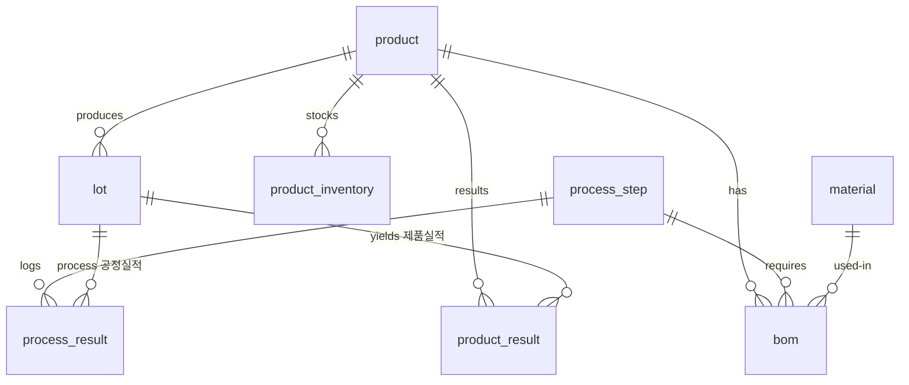
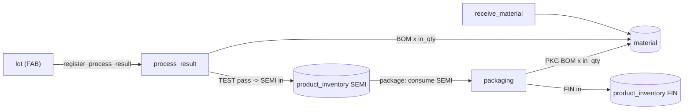

# Mock MES Redesign — BOM, Two-Stage Production & Split Inventory — Design

**Status:** Approved (design phase)
**Date:** 2026-07-21
**Repo:** `ChangJu-Ahn/mock-mes-kr` (public) · branch `changju-ahn-feat-mock-mes`

## Goal

Redesign the mock MES data model from scratch so it realistically models a
semiconductor fab as **two production stages (FAB → Packaging)** with a simple
**BOM** that drives **material consumption**, and **two separate inventories**
(product/semi-product vs. material). Keep the existing deployment, proxy, CI, and
API-key auth infrastructure. Re-split the REST and MCP surfaces so **each surface
exposes both queries and transactions**. Finally, add a human-facing **Guide page**
to the web console that explains MES usage and the overall process flow.

## Approach (chosen: A)

Clean rebuild of the `mes_core` schema, seed, and data-access layer; rebuild the
REST, MCP, and web console on top of the new model. **Reuse unchanged:** the one
Docker image / three entrypoints, the Caddy proxy, the GitHub Actions GHCR image
build, the Bicep ACA deployment, and the `X-API-Key: changjuahn` auth gate. Same
repo, same live FQDN, same key.

## Global Constraints

- Python 3.12. FastAPI + Uvicorn (web console + REST). Jinja2 + a little HTMX.
  MCP official Python SDK (`mcp`, streamable HTTP). Built-in `sqlite3`, WAL mode +
  `busy_timeout` for safe multi-process access.
- ONE shared `mes_core` package imported by both `api` and `mcp_server`.
- ONE shared **ephemeral** SQLite DB on an EmptyDir volume; **re-seeded on every
  cold start** (deterministic dataset).
- MVP / demo only. Cheapest ACA: scale-to-zero, single replica, 0.25 vCPU /
  0.5 GiB per container.
- **Auth:** all REST `/api/*` and MCP `/mcp` require header `X-API-Key: changjuahn`
  (env `MES_API_KEY`, default `changjuahn`). Web console and `/api/docs` /
  `/api/openapi.json` stay open.
- No planning markdown committed to the repo except this spec under
  `docs/superpowers/specs/` and the plan under `docs/superpowers/plans/`. README is
  the only narrative product doc.
- Every commit carries the trailers:
  ```
  Co-authored-by: Copilot App <223556219+Copilot@users.noreply.github.com>
  Copilot-Session: 0d70b324-d6e5-43c3-bc34-5805eac6db87
  ```

## Terminology

| Old | New | Meaning |
| --- | --- | --- |
| 공정입력 / process_history | **공정실적** `process_result` | A lot passes one process step; consumes materials |
| 실적입력 / production_result | **제품실적** `product_result` | A lot becomes output (semi/finished); increments inventory |
| inventory (single) | **material** + **product_inventory** | Two separate inventories |
| — | **bom** | Per product × step material usage list |
| — | **product** | Product master |

Inventory item types: `SEMI` (반제품, output of the FAB stage) and `FIN` (제품,
output of the Packaging stage).

## Data Model

### Tables

**product** — product master
- `product_code` TEXT PK, `product_name` TEXT, `tech_node` TEXT

**process_step** — process route
- `seq` INTEGER, `step_code` TEXT PK, `step_name` TEXT, `operation` TEXT,
  `eqp_type` TEXT, `stage` TEXT (`FAB` or `PACK`)
- FAB steps: DIFF, PHOTO, ETCH, IMPL, CVD, CMP, METRO, TEST (seq 10..80).
  Packaging pseudo-step: `PKG` (seq 90, stage `PACK`).

**equipment**
- `eqp_id` TEXT PK, `eqp_name` TEXT, `type` TEXT, `status` TEXT

**material** — material inventory (global on-hand stock, one row per material)
- `material_code` TEXT PK, `material_name` TEXT, `category` TEXT, `qty` REAL,
  `uom` TEXT, `location` TEXT

**bom** — material required per product per step (FAB steps and `PKG`)
- `id` INTEGER PK AUTOINCREMENT, `product_code` TEXT FK, `step_code` TEXT FK,
  `material_code` TEXT FK, `qty_per_wafer` REAL, `uom` TEXT
- UNIQUE(`product_code`, `step_code`, `material_code`)

**lot** — FAB lots (wafers)
- `lot_id` TEXT PK, `product_code` TEXT FK, `tech_node` TEXT, `start_qty` INTEGER,
  `wafer_qty` INTEGER (current), `priority` TEXT, `current_step` TEXT,
  `status` TEXT (`Running`/`Hold`/`Done`), `start_date` TEXT

**process_result** — 공정실적 (per lot per step; material-consuming)
- `id` INTEGER PK AUTOINCREMENT, `lot_id` TEXT FK, `step_code` TEXT FK,
  `eqp_id` TEXT, `in_qty` INTEGER, `out_qty` INTEGER, `scrap_qty` INTEGER DEFAULT 0,
  `defect_code` TEXT, `in_time` TEXT, `out_time` TEXT, `operator` TEXT, `result` TEXT

**product_inventory** — 제품 인벤토리 (semi + finished)
- `product_code` TEXT, `item_type` TEXT (`SEMI`/`FIN`), `qty` REAL, `uom` TEXT,
  `location` TEXT
- PK(`product_code`, `item_type`)

**product_result** — 제품실적 (each inventory increase, with lot traceability)
- `id` INTEGER PK AUTOINCREMENT, `result_date` TEXT, `lot_id` TEXT FK (nullable),
  `product_code` TEXT FK, `item_type` TEXT (`SEMI`/`FIN`), `good_qty` INTEGER,
  `scrap_qty` INTEGER, `yield_pct` REAL,
  `source` TEXT (`AUTO_FAB`/`AUTO_PACK`/`MANUAL`), `line` TEXT, `eqp_id` TEXT

### Relationships (ERD)



Indexes: `process_result(lot_id)`, `process_result(step_code)`,
`product_result(product_code)`, `product_result(result_date)`, `bom(product_code)`,
`bom(step_code)`, `lot(current_step)`.

## Transaction Flows



1. **start_lot(product_code, start_qty, priority?)** → create a FAB lot:
   `status=Running`, `current_step=`first FAB step, `wafer_qty=start_qty`,
   `start_date=`today. Returns the lot.

2. **register_process_result(lot_id, step_code, in_qty?, scrap_qty?, defect_code?,
   eqp_id?, operator?, result?)** — 공정실적:
   - `in_qty` defaults to lot's current `wafer_qty`; `out_qty = in_qty − scrap_qty`
     (guard `0 ≤ scrap_qty ≤ in_qty`).
   - Update lot: `wafer_qty ← out_qty`, `current_step ← step_code`.
   - **Material consumption:** for each `bom(product, step_code)`:
     `material.qty ← max(0, material.qty − qty_per_wafer × in_qty)`; collect any
     `shortages[]` where demand exceeded stock.
   - **On final FAB step (TEST) pass** (`result` in Pass/OK/Good and step seq is the
     max FAB seq, and lot not already Done): set `status=Done`, insert
     `product_result(item_type=SEMI, lot_id, good_qty=out_qty,
     scrap_qty=cumulative lot scrap, source=AUTO_FAB)`, and
     `product_inventory[product, SEMI].qty += out_qty`.
   - Returns the process_result row + `shortages[]` + any semi-receipt.

3. **package(product_code, in_qty, scrap_qty?, lot_id?, eqp_id?, operator?)** —
   패키징 실적 (single transaction):
   - Guard: `product_inventory[product, SEMI].qty ≥ in_qty`, else reject
     (`ValueError`).
   - `out_qty = in_qty − scrap_qty`; `product_inventory[SEMI] −= in_qty`;
     `product_inventory[FIN] += out_qty`.
   - **Material consumption:** for each `bom(product, 'PKG')`:
     `material.qty ← max(0, material.qty − qty_per_wafer × in_qty)` with
     `shortages[]`.
   - Insert `product_result(item_type=FIN, lot_id?, good_qty=out_qty, scrap_qty,
     yield_pct=out/in×100, source=AUTO_PACK)`.
   - Returns the product_result + `shortages[]`.

4. **register_product_result(lot_id, item_type, good_qty, scrap_qty?)** — manual
   제품실적: insert `product_result(source=MANUAL)` and
   `product_inventory[product_of_lot, item_type] += good_qty`. No material
   consumption (manual correction/record). `product_code` derived from the lot.

5. **receive_material(material_code, qty, material_name?, category?, uom?,
   location?)** — 자재 입고: `material.qty += qty`; create the material row if it
   does not exist (using the optional descriptive fields).

6. **upsert_bom(product_code, step_code, material_code, qty_per_wafer, uom?)** /
   **delete_bom(id)** — BOM authoring.

**Shortage policy:** material shortfall does NOT block a process/packaging move
(the demo line keeps running); the response lists `shortages[]`. Semi-product
shortfall DOES block packaging (cannot build finished goods without dies).

## Surface Split

Both REST and MCP expose queries **and** transactions. Cross-surface reads over
the one shared SQLite DB are intentional (they showcase the shared store).

### MCP — "Process & Lot" (`/mcp`, requires `X-API-Key`)

- **Transactions:** `start_lot`, `register_process_result`
- **Queries:** `get_lot`, `list_lots`, `get_process_route`,
  `list_process_results`, `get_wip`

### REST — "Product · Material · BOM" (`/api/*`, requires `X-API-Key`)

- **Transactions:**
  - `POST /api/product-results` (manual 제품실적)
  - `POST /api/packaging` (패키징)
  - `POST /api/materials/receipt` (자재 입고)
  - `PUT /api/bom`, `DELETE /api/bom/{id}` (BOM edit)
- **Queries:**
  - `GET /api/products`
  - `GET /api/product-inventory` (filter `item_type`, `product`)
  - `GET /api/product-results` (filters: product, item_type, source, date range)
  - `GET /api/materials` (filters: category, location, search, qty range)
  - `GET /api/materials/by-step` (materials grouped by consuming step via BOM =
    "각 공정에 남은 자재")
  - `GET /api/bom` (filter product/step)
- Open (no key): `GET /api/docs`, `GET /api/openapi.json`.

### Web console — human control panel (`/`, open, ALL functions, view + input)

Dashboard (`/`), Lots (list + start-lot form + lot detail with 공정실적 history),
Process results (input form + history), Process route, Product inventory
(semi/finished), Material inventory (+ receive-material form + by-step view), BOM
(view + edit), Product results (view + manual input), Packaging (input form), WIP,
Equipment, **Guide (사용법/공정흐름 안내)**.

### Guide page (`/guide`, open, human-facing)

A single static help page, linked from the top nav, that onboards a first-time
user in plain language (Korean-first, with the English/한자 terms in parens):

- **What this is:** a throwaway mock MES for a semiconductor fab, used as a
  connection point for agent demos; data is ephemeral and re-seeded on every cold
  start.
- **Overall process flow** (rendered as a simple numbered diagram/list):
  자재입고 → 로트 투입 → FAB 8공정(공정실적, 자재 소비) → TEST 통과 시 반제품 입고
  → 패키징(반제품 소비 → 제품 입고) → 제품/반제품 인벤토리 조회. Show where each
  inventory moves.
- **How to use each function:** a short "what it does / where to click" line per
  web page (로트 투입, 공정실적 입력, 패키징, 제품실적 수동입력, 자재입고, BOM 편집,
  각 조회 화면), including the material-consumption and 반제품/제품 concepts.
- **How agents connect:** REST (`/api`, docs at `/api/docs`) and MCP (`/mcp`) both
  require header `X-API-Key: changjuahn`; the web console and docs are open. Point
  to the README for full request/response examples.

The page is a plain Jinja2 template with no data queries (static copy + the shared
layout), so it never needs the DB or a key.

## Seed Dataset (deterministic)

- **product (4):** LX9 AP (5nm), DDR5-16G (10nm), V7 NAND (128L), PMIC-33 (28nm)
- **process_step:** FAB 8 (DIFF, PHOTO, ETCH, IMPL, CVD, CMP, METRO, TEST) + `PKG`
- **equipment (~9):** furnace, EUV/DUV scanners, etcher, implanter, CVD, polisher,
  prober, bonder (packaging)
- **material (~12):** blank 300mm wafer, EUV reticle, EUV photoresist, CMP slurry,
  SiH4, Ar, Cu target + packaging materials: substrate, bond wire, mold compound,
  solder ball. Each with an on-hand `qty`.
- **bom (~30):** realistic per-product material usage on the steps that use them
  (e.g. PHOTO→photoresist, ETCH→gases, CVD→SiH4, CMP→slurry; PKG→substrate/wire/
  mold/solder). `qty_per_wafer` small decimals/units.
- **lot (~16):** distributed across FAB steps; mix of Running/Hold/Done. Done lots
  have produced SEMI stock.
- **process_result (~75):** step history for the lots (realistic in/out/scrap).
- **product_inventory:** SEMI rows from completed FAB lots; FIN rows for the
  product(s) whose semi stock was packaged.
- **product_result:** AUTO_FAB rows for completed FAB lots, a few AUTO_PACK rows,
  and one MANUAL example.
- Fixed RNG seed so every cold start reproduces the identical dataset. Baseline
  counts are asserted in tests and used for the live cold-start reseed check.

## Testing Plan

- **Unit (`mes_core`):** schema init; `start_lot`; `register_process_result`
  material consumption (`qty_per_wafer × in_qty`) and lot advance; FAB-complete
  auto SEMI receipt; `package` (semi consume → fin produce + PKG BOM consume);
  `receive_material`; `upsert_bom`/`delete_bom`; `product_inventory` arithmetic;
  guards (semi shortage → packaging rejected; material shortage → `shortages[]`
  flagged, move still succeeds); deterministic seed baseline counts.
- **REST (`TestClient` with `X-API-Key`):** every query + transaction endpoint;
  auth gate (401 without/with wrong key, 200 with key; web console pages incl.
  `/guide` and `/api/docs` open without a key); OpenAPI advertises the key scheme.
- **MCP:** tool functions in-process (`start_lot`, `register_process_result`,
  queries); `_ApiKeyGuard` ASGI unit test.
- **Cross-channel (local + live scripts):** MCP `register_process_result` consumes
  material → REST `/api/materials` shows the drop; FAB completion → REST
  `/api/product-inventory` SEMI increases; REST `package` → FIN increases + SEMI
  decreases; all readable across surfaces.

## Deployment

No infrastructure change (the schema is app-internal). Reuse the Dockerfile (init=
seed, api, mcp), Caddy proxy, GHCR image build workflow, Bicep ACA definition, and
the `MES_API_KEY` env wiring. Flow: commit → push branch → GitHub Actions rebuilds
both public GHCR images → `./infra/deploy.sh` rolls a fresh ACA revision (cold-start
reseed) → live smoke (REST + web + one MCP tool, keyed) → confirm cold-start reseed.
Rewrite `README.md` for the new model, endpoints, and agent-integration examples.

## Out of Scope (YAGNI)

- Material lot/batch traceability ledger (only current on-hand `qty` is tracked).
- Multi-step packaging route (packaging is a single transaction).
- Real authentication / RBAC / multi-tenant / persistence / scale-out.
- Editing/deleting process or product results (append-only history).
